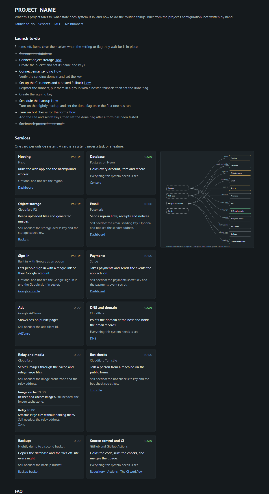

<p align="center">
  <a href="https://bitblitzin.com/bootstrap"><picture>
    <source media="(prefers-color-scheme: dark)" srcset="assets/bootstrap-lockup-on-dark.png">
    
  </picture></a>
</p>

<p align="center"><strong>House rules for thirty agents.</strong><br>
A Claude Code plugin for projects where many coding agents work at once.</p>

<p align="center">
  <a href="https://github.com/Pawper/bitblitzin-bootstrap/releases"></a>
  <a href="LICENSE"></a>
  <a href="#tests"></a>
  <a href="https://bitblitzin.com/bootstrap"></a>
</p>

Without it, thirty agents behave like thirty new hires with no manager: they write notes in the same file, run the slowest test, merge over each other, and nobody knows the state of the project. The plugin gives the project house rules and the machinery that enforces them, so the rules hold when nobody is watching. It decides one home for each kind of thing, refuses the commands that make agents collide, keeps the board honest, merges in batches, and opens every session with the live state of the project. Every rule came from something that went wrong on a real project, one lesson per pull request.

It is the enforcement layer between an agent orchestrator and the repository: not a cockpit for launching agents, not a spec-writing tool, not a hosted merge queue. It sits alongside those. [Where it fits among them](https://bitblitzin.com/bootstrap#fits) is on the site.

**Install**, from a shell:

```bash
claude plugin marketplace add Pawper/bitblitzin-bootstrap
```

```bash
claude plugin install bitblitzin-bootstrap@bitblitzin-bootstrap
```

In a terminal session the same two lines work as `/plugin marketplace add ...` and `/plugin install ...`. In the desktop app `/plugin` opens a panel and ignores what follows it; use the panel's "add marketplace" with `Pawper/bitblitzin-bootstrap`, then install from it, or use the shell lines above.

Then, in a new or struggling repository: `/project-bootstrap set this project up for many agents`.

**What you get**

- **Ten hooks.** Deletes, forced pushes, full test sweeps, hand edits to generated pages, issues without a State, agents dispatched on a heavier model than the task needs, merges that go around the queue, pull requests closed without a reason, detached worktrees, build daemons stopped on a machine that hosts a runner, commands too big for the task window or with no title: all refused before they run, each with one sentence saying what to do instead. A stop hook that will not let a task end with files stranded in its worktree. A session brief that prints today's date in the owner's time zone, main, the open pull requests, who has the ball on every issue, the queue, the leftovers and the proposed next round, in two seconds and one network call.
- **Templates for everything the skill creates.** Issue template, CLAUDE.md and AGENTS.md, the status page that builds itself from stubs, a CI skeleton that runs only what a change touches and reports once, a merge queue that batches by default and says in plain words why a run is stuck, board and label scripts, a nightly audit that speaks only when something is wrong, a worktree script that gives every branch an ending.
- **Two more skills.** `/project-status` has light subagents read bodies and comments, only for items that changed, so you keep one line per item. `/project-drive` proposes the next round from the board and the checks and pursues only what you approve.
- **An owner console.** One page, from one config file: what the project talks to, the state of each system, how to do the routine things.



It was built for GitHub, Actions, `gh` and Claude Code. When a project uses something else, the skill says so once and adapts. [The full story is below](#why); the [user flow](#the-user-flow-start-to-finish) is ten short steps.

## Why

Rules written for one agent become pathologies when thirty follow them at once. One agent appending a line to a status page is tidy; thirty doing it is a merge conflict on every PR. One agent running the full test suite before it pushes is careful; thirty doing it is a merge queue that waits an hour per change. The codebase is the one surface every agent must write to, so anything that lives there is something they all collide on.

The fix is to decide two things before the first feature agent runs:

- **Homes.** One place for each kind of thing. Work lives in issues, status on the board, orientation on one generated page, data in the database, research outside the repo. Nothing goes anywhere else.
- **Enforcement.** An instruction decays under load. For every rule there is a hook that blocks the dangerous command, a CI check that fails on drift, a required field at filing, or an audit that speaks only when something is wrong. A rule with none of those will not hold.

This repository holds the skill that walks through those decisions, the hooks that enforce the rules, and templates for every file the skill creates.

## The stack it was built for, and yours

The plugin has a preferred stack: GitHub for issues, the project board and Actions, the `gh` CLI in its scripts, Claude Code for the hooks, and a plain Markdown spec folder per feature. It is honest about that. When a project uses something else, the skill says so once and then adapts: every home and every rule is about a kind of place, not a product, so the agent proposes the nearest equivalent and keeps the rule.

| Preferred | If you use | The agent proposes |
|---|---|---|
| GitHub issues, one per task | GitLab, Jira, Linear, a plain tracker | Their issue with a required State field or label; the PR or MR still closes it |
| GitHub project board with a State field | GitLab boards, Jira board, Linear views | A board grouped by State fed by the tracker's own automation, never a hand-kept page |
| GitHub Actions | GitLab CI, Buildkite, Jenkins, CircleCI | The same jobs: classify, per-class, one summary check, full run on main, red run opens an issue |
| `gh` in scripts | `glab`, a REST call, the tracker's CLI | The same scripts with the calls swapped; the pure parts are tool-free and tested |
| Claude Code hooks | Another agent runtime | That runtime's pre-command hook if it has one; otherwise a CI check or a git hook, and the agent says the rule is weaker |
| Spec folder per feature, by hand or with GitHub's spec-kit | Any spec tool, or none | A folder per feature with a constitution and a spec file; the CI check holds either way |

What never changes: one home per kind of thing, nothing appended to a shared page, every rule has something that enforces it, and the full suite gates main rather than the PR.

## What is in the box

| Piece | Where | What it does |
|---|---|---|
| The skill | `skills/project-bootstrap/SKILL.md` | The design: homes, rules, enforcement, CI from day one, and the outputs in order |
| The hooks | `hooks/hooks.json`, `hooks/scripts/` | Ten hooks that refuse the dangerous commands, the wasteful dispatches, the slow merge pattern and the loose ends before they run; one that refuses to finish a task in a worktree that is not clean; and one that prints the project's live state at session start |
| The templates | `templates/` | Issue template, CLAUDE.md and AGENTS.md, setup and notice skeletons, the status page and its scripts, the CI workflow, the merge queue, the board setup, the nightly audit |
| The owner console | `console/`, sample in `templates/console/` | One page: what the project talks to, the state of each system, how to do the routine things |
| The status skill | `skills/project-status/SKILL.md`, `scripts/board/`, `workflows/board-digest.js` | Where every open issue and pull request really stands, from bodies and comments, read by light subagents and only when an item changed |
| The drive skill | `skills/project-drive/SKILL.md`, `scripts/drive/` | One round: read the board and the checks, propose what to do next, pursue only what a person approved |
| The tests | `tests/run.sh` | One test per pure function in every script, plus the console's Node tests |

## Install

### As a plugin

From a shell, which also works in a setup script:

```bash
claude plugin marketplace add Pawper/bitblitzin-bootstrap
```

```bash
claude plugin install bitblitzin-bootstrap@bitblitzin-bootstrap
```

In a terminal session the same two lines work as slash commands, `/plugin marketplace add Pawper/bitblitzin-bootstrap` and `/plugin install bitblitzin-bootstrap@bitblitzin-bootstrap`. In the desktop app `/plugin` opens its panel and ignores arguments: add the marketplace there by source, `Pawper/bitblitzin-bootstrap`, then install `bitblitzin-bootstrap` from it. The first line registers the catalog (this repository's `.claude-plugin/marketplace.json`); the second installs the plugin it lists, which is why both halves of `name@marketplace` read bitblitzin-bootstrap.

Pick the scope you want when asked. User scope gives you the skill and the hooks in every project. Project scope writes the plugin into the repository's `.claude/settings.json` so every collaborator gets the hooks too, which is the point.

To try a local checkout without installing it:

```bash
claude --plugin-dir /path/to/bitblitzin-bootstrap
```

### Copy the folder

If you want only the skill, copy `skills/project-bootstrap/` into `~/.claude/skills/` to use it everywhere, or into a project's `.claude/skills/`. The hooks do not come along that way; to get them without the plugin, copy `hooks/scripts/` into the project and point `.claude/settings.json` at the scripts with the same five entries as `hooks/hooks.json`, replacing `${CLAUDE_PLUGIN_ROOT}` with `${CLAUDE_PROJECT_DIR}`.

## Use

Start a session in a new or struggling repository and say what you want:

```text
/project-bootstrap set this project up for many agents
```

The skill walks the homes table, writes the rules into CLAUDE.md and AGENTS.md, and copies the templates in. Replace every CAPITALIZED placeholder, then run two scripts:

```bash
sh scripts/board.sh OWNER OWNER/REPO
```

```bash
sh status/build.sh
```

Then switch on the board's built-in workflows by hand, as described below, and let the first feature agent run.

## The user flow, start to finish

This is what a person does with the plugin, from install to the first feature agent, and what runs on its own after that.

1. **Install.** In a Claude Code session, add the marketplace and install the plugin with the two commands above. Pick project scope so every collaborator gets the hooks. From this moment the ten hooks are live: deletes, forced pushes, full test sweeps, direct edits to generated pages, issues without a State label, agent dispatches without a fitting model, merges around the queue, the serial merge pattern, pull requests closed without a reason and detached worktrees, a shared build daemon stopped on a machine that hosts a runner, and a Bash call with no title or too big for the task window are refused with one sentence each.
2. **Run the skill.** In a new or struggling repository, say `/project-bootstrap set this project up for many agents`. The skill looks at the repository first, then asks a short survey for what it could not tell: a sibling repository to copy the stack from, new or existing project, where issues and CI live, which agent runtimes, the one-file test command, which pages are generated, the spec tool, runners, the owner's time zone, and where the work folder goes. It records the answers under a Stack heading in CLAUDE.md, walks the homes table, writes the rules into CLAUDE.md and AGENTS.md, and copies the templates in, adapted to the answers. Replace every capitalized placeholder that is left; two of them, `RUNS_ON` and `RUN_SHELL` in `ci.yml` and `queue-drain.yml`, say where jobs run and which shell they get, and on a Windows runner the shell must be Git's bash by its short path.
3. **Create the board and labels.** Run `sh scripts/board.sh OWNER OWNER/REPO`. It creates the seven state labels, the project board, its State field with the seven values, and links the repository, then prints the board's address; put that link in front of the owner.
4. **Branch protection, in one command.** `sh scripts/protect-main.sh` sets the rules the queue needs: one required check, `CI passed`, up to date off, a pull request required. Then the one setting GitHub cannot script: in the board's Workflows tab, switch on the four built-in workflows listed under The project board.
5. **Build the status page once.** Run `sh status/build.sh` and commit STATUS.md. From here on CI fails any PR that leaves the page stale, and the hook refuses hand edits to it.
6. **Write the constitution and the first spec.** Fill in `specs/constitution.md` once, then copy `specs/001-FEATURE/` to `specs/<feature>/` for the first feature. If you use spec kit, run it inside that folder; the templates are plain Markdown and do not depend on it. From here on CI fails any PR that changes `src/` without a change in a spec folder.
7. **Open the owner console.** Run `node "$CLAUDE_PLUGIN_ROOT/console/cli.js" console` and open the page it names. Fill in `console/services.json` for the systems the project really talks to; the launch to-do shows what is left and clears on its own as settings land.
8. **Turn on the drive.** Copy `.claude/project-drive.json` in and file one issue titled "Drive" labeled `drive`. From then on `/project-drive`, by hand or on a timer, reads the board and the checks, proposes what to do next, and waits for your approval before doing any of it. Every session also opens with the proposal under "Proposed next."
9. **Day to day.** Each task starts as an issue with a State, filed from the template or with `gh issue create --label state:ready`, and the coordinator sets the board field with `scripts/state.sh`. Agents work in worktrees, run only the tests for the files they changed, and open PRs. CI runs only the classes a PR touches and reports once through `CI passed`. The merge queue script merges a green PR without a re-run when main moved outside its classes. The full suite runs on main after every merge and opens a `ci-red` issue when it fails. Every night the audit comments on the tracking issue only when an issue has no State or a merged PR left one stale.
10. **When a hook refuses something.** The message says what was blocked and what to do instead; do that. A project that really needs an exception changes `.claude/generated-pages.txt` or disables the plugin for that repository. Nobody works around a hook.

## On an existing repository

The same pieces, a different order, one pull request per step. The skill's section "On an existing project" has the full sequence; the short version:

1. Survey, naming the pages that grow by appending and the hand-kept status page.
2. Hooks on, with those pages in `.claude/generated-pages.txt`, so the next append is refused that day.
3. Labels and the audit. The first night's comment is the backlog of issues with no State, not a failure.
4. The status page, with one stub per existing feature mined from the old page, which is then moved aside.
5. CI in this order: the summary job and the setup check, which fail nothing that passes today; the spec check, which is incremental; line endings last, as one normalizing commit made when no pull requests are open.
6. The board: pass `--existing NUMBER` to `scripts/board.sh` so it adds the State field to the board you have instead of creating a second one.
7. The console, from the example env file you already have. Its check names every setting with no card yet.
8. The worktree backlog. Run `sh scripts/worktrees.sh list` to see how many there are and in how many folders, `prune` to see which belong to merged branches, and `prune --apply` to remove the clean ones. Branches are kept. From then on the merge queue removes each one as its pull request lands.

Never overwrite. Where a template's file already exists, the skill writes the skeleton beside it as `NAME.bootstrap.md` and leaves the merge to a person.

## What each hook blocks and why

Every hook reads the tool call before it runs, and when it refuses, it prints one plain sentence saying what it blocked and what to do instead. The scripts are POSIX shell with awk and nothing else, so they run under Git Bash on Windows and on macOS and Linux as they are.

**Deletes.** `rm`, `rmdir`, `del`, `erase`, `rd`, `Remove-Item`, `ri`, and `git clean`, including inside a `cmd /c` or `powershell -Command` wrapper. With many agents, a delete is the one change nobody else can undo, and a file one agent considers dead is often the file another is reading. The rule is never delete; move aside. The hook says so and suggests `git mv`. There is one sanctioned cleanup: the worktree of a merged branch, removed through `scripts/worktrees.sh`, because a worktree is a checkout and the branch keeps the work.

**Forced pushes.** `git push` with `--force`, `--force-with-lease`, `--force-if-includes`, `-f` in any combined flag, or a `+` refspec. A rewritten branch pulls the ground out from every worktree based on it. Push a new commit instead, or start a new branch.

**Full test sweeps.** A bare test command with no file, directory or filter after it: `pytest`, `npm test`, `yarn test`, `pnpm test`, `jest`, `vitest`, `mocha`, `go test ./...`, `cargo test`, `dotnet test` and the common launchers in front of them such as `npx`, `uv run` and `python -m`. Tests on a PR prove the change and run per file. The full suite is the gate on main, run once by CI after the merge, not thirty times before it.

**Direct edits to generated pages.** An `Edit`, `Write` or `MultiEdit` whose path matches a line in the project's `.claude/generated-pages.txt`. When that file is absent the list is just `STATUS.md`. A generated page is built from stubs; a hand edit is lost on the next build and is the shared file every agent would otherwise append to. The hook points at the stub and the build script.

**Issues without a State.** `gh issue create` with no `--label state:...`. The board and the nightly audit can only be trusted if every issue carries its state from the moment it is filed, and filing is the moment the agent already knows it. `gh issue create --web` is allowed because the issue form requires the field itself.

**Agents dispatched without a fitting model.** An `Agent` call with no `model`, or with a model heavier than its task needs, and a `Workflow` script with an `agent()` call that sets no model. Thirty agents each fanning out subagents on the heaviest model is the fastest way to spend a usage budget on lookups. The hook sorts the task by its type, description and prompt into a lookup (haiku), routine work (sonnet) or hard work (opus), and refuses when the model is missing or heavier than that. A lighter model than suggested is always allowed. Agents inherit the session's effort level and there is no per-agent effort setting, so the message reports the current effort and says to lower it before a long lookup.

**Merging around the queue.** A direct `gh pr merge`, in any project that has the merge queue script. One agent merged by hand all day because the queue was one line in CLAUDE.md and nothing stopped it; every other rule had a hook behind it. The queue is what checks the folder, waits for a quiet main, batches, holds a change until its migration has run, cleans up the worktree and records flaky tests. The hook points at `merge-queue.sh --drain` for everything green and `--serial PR` for one. Turning auto-merge off is allowed.

**The serial merge pattern.** `merge-queue.sh` with more than two pull request numbers and neither `--batch`, `--serial` nor `--drain`. One project merged seven pull requests one at a time, each with its own full browser run, in ninety minutes; thirteen went through one integration branch with scoped tests and one full run in twenty. Merging must never take longer than the development did, so the batch is the unit of merging. `--serial` is always allowed, because a migration or a risky change should land alone by choice, and two or fewer pull requests without a flag are allowed. The notes in `templates/scripts/ci/QUEUE.md` say when to batch and when not to.

**Loose ends.** `gh pr close` with no `--comment`, and `git worktree add --detach`. A closed pull request with no reason leaves a worktree and a branch nobody can judge later; one project found nineteen worktrees belonging to closed pull requests and eight to branches with none. A detached worktree holds commits reachable only from that folder. The same hook refuses a command that would wait forever for input nobody will type: a `cat`, `tee`, `head`, `tail`, `wc`, `sort` or `read` at the start of a pipeline with no file and nothing redirected in. A stray `cat >> /dev/null` hung one agent's shell for fifteen hours. A file, a pipe, a redirect or a heredoc all pass. The hook points at `scripts/worktrees.sh close PR "reason"`, which comments, closes, keeps the branch's commits under a `closed/` tag, and removes the worktree and the branch. It also refuses `gradlew --stop`, `nx reset` and the other daemon stops, which on a machine that hosts a runner kill the runner's build mid-job (`DAEMON_STOP_OK=1` says no runner is here), and it refuses a Bash call with no description or one over twelve lines or a thousand characters: the desktop app's task window shows the raw command as the task's title, and a program pasted into a heredoc fills it with source and has no name. Such a program belongs in `.scratch/`, written once and run by name, with a one-line description on the call.

**An unfinished folder, at the end of a task.** This one runs when an agent tries to finish, not before a command. Inside a linked worktree, where an agent works on one task, `require-clean-worktree.sh` refuses to let the task end while there are files modified or untracked outside `.scratch/`, images or build output in the worktree, or a process still running from that folder. A clean folder is part of done: files written minutes before a merge and never committed were how real work got stranded. It names the first five files and says what to do: commit them, list them in the pull request as deliberately left out, or move scratch into `.scratch/`. It kills nothing and removes nothing. It refuses once; a second stop goes through, so a session can never be trapped. In the main checkout, where a person is usually mid-work, it stays out of the way. The merge queue applies the same folder test when a pull request is queued.

**And one hook that blocks nothing: the session brief.** At every session start, resume and clear, `session-brief.sh` prints the project's live state in one short block, at most forty lines, so the agent can answer on the first turn with no tool calls. It makes exactly one network call, one GraphQL query in `board-now.sh` that returns every open pull request with its check status and every open issue with its labels; everything else is local git. The block holds: the last five commits on main and whether the tree is clean, the open pull requests with their mergeability and CI, the open issues counted by state with the ones in progress, waiting on the owner and ready named, whether the merge queue ran in the last two hours and its last line, how many local branches have commits not on main, how many worktrees there are and in how many folders, the first two lines of the newest handoff note, and the drive's proposal. Long lists are counted, not printed. From the saved digest it also prints who has the ball on each item that is waiting on the owner, blocked or in progress, and how many summaries are out of date. Its first line tells the agent to reply from it first, to run `/project-status` for where each item really stands, and never to run one network call per branch, worktree or issue itself. In this repository the whole hook takes about two seconds. A clear prints the short form, main and in progress only. A project's CLAUDE.md and an agent's memory both describe the past; this prints the present, so the agent starts from facts. It reads `.claude/session-brief.json` for the queue log glob, the memory folder and the line limit, and without that file prints only the git and gh sections. Every git and gh call fails soft: a missing or signed-out tool makes its section say "(unavailable)" and the hook still exits cleanly within its twenty-second timeout. It never prints a token, a secret or an environment value.

**When a hook change takes effect.** A hook newly registered in `hooks.json` loads on the next session start. An edit to a script that is already registered applies at once, on the next tool call, because the script is read each time it runs. So after adding a hook, restart the session; after fixing one, do not.

**When a plugin update reaches an installed copy.** The manifest carries a version, and an installed copy stays on the version it was installed at until that number changes. A project that installed 0.1.0 does not have the session brief, the batch hook or the drive. Update it, then start a new session:

```bash
claude plugin marketplace update bitblitzin-bootstrap
```

```bash
claude plugin update bitblitzin-bootstrap@bitblitzin-bootstrap
```

A session started with `--plugin-dir` reads the checkout on disk and is always current.

**Updating the plugin does not update a project's copies of its scripts.** The templates are copied once, at bootstrap. One project bootstrapped on October 4 was still running that day's merge queue four days later, with no batch mode and no drain, and its agent asked for both. The session brief now says when the plugin's scripts in a project are out of date, and one command brings them current:

```bash
sh "$CLAUDE_PLUGIN_ROOT/scripts/sync/sync-templates.sh"
```

That reports which plugin-owned files differ or are missing, which config files would be added with their defaults, and what the template gained in the files the project owns (jobs missing from `ci.yml`, lines missing from `.gitattributes` and `.gitignore`). A file the project has edited since bootstrap is marked, so its diff gets a careful look. With `--apply` it writes the plugin-owned files and the missing defaults on a new branch and commits them, for a pull request; it never touches the project's own files and never pushes. `templates/OWNED.txt` lists which files are the plugin's.

Sample of what a refusal looks like, from the delete hook:

```text
Blocked `rm` because this project never deletes files; move them aside instead, for example `git mv path aside/path` or `mv path path.aside`.
```

If a hook refuses a command you believe is right, the answer is still the one in the message. A project that needs an exception should change the list in `.claude/generated-pages.txt` or disable the plugin for that repository, not work around the hook.

## The templates

All of them live in `templates/` and are meant to be copied into the project root as they are.

- `.github/ISSUE_TEMPLATE/task.yml`: one issue per task, with a required State dropdown. `config.yml` turns off blank issues.
- `.github/workflows/state-label.yml`: when an issue is opened or edited, sets the `state:` label to match the State field and removes the others.
- `CLAUDE.md` and `AGENTS.md`: the homes table, the rules, and a table of what enforces each one. Keep them identical.
- `SETUP.md`: the one manual. Configuration by name, first run, migrations run, services.
- `NOTICE.md`: credit for borrowed code, one line per item.
- `status/`: one stub per feature in `stubs/` (the example is `example-stub.md`, outside the folder the build reads), a `services.txt`, and `lib.sh`, `build.sh` and `check.sh`. The build writes `STATUS.md`; the check fails when the page does not match the stubs, and CI runs it on every PR.
- `specs/constitution.md` and `specs/001-FEATURE/spec.md`: the rules every spec obeys, written once, and the skeleton for one feature's spec. One folder per feature, so two PRs never edit the same spec file.
- `scripts/ci/spec-check.sh`: fails a PR that changes `src/` without belonging to a spec: naming one in its body (`Spec: specs/<feature>`) or, when the design changed, changing the feature's folder. The constitution does not count, so nobody pokes it to satisfy the check. More than one spec folder in a PR is a warning that the task was too big, not a failure.
- `scripts/ci/setup-check.sh` and `setup-paths.txt`: fails a PR that changes a setup file (migrations, including `supabase/migrations/`, the example env file, the container files) without a change to the manual. Dependency manifests and workflows are not setup steps and are not listed. The manual is `SETUP.md` unless a `manual PATH` line in `setup-paths.txt` names another.
- `scripts/ci/line-endings.sh` and `.gitattributes`: the attributes file forces LF everywhere; the check fails on any tracked text file that still has CRLF.
- `console/services.json` and `.env.example`: the one file that drives the owner console, and the example env file the console check reads it against.
- `.claude/session-brief.json`: the owner's time zone, which the brief names on its date line; where the merge queue logs live; the agent's memory folder, which defaults to Claude Code's own for the project when left empty; and how many lines the brief may print. Commented in the file itself.
- `.claude/project-drive.json`: runners, the agent and minute budgets per drive round, the queue log glob, and the owner decisions list. Commented in the file itself.
- `merge-queue.sh --drain`: merge everything that is green, round after round, batching when more than two are ready, until nothing is left or its bounds are reached. The answer to "merge what is ready", so nobody writes a loop. A red pull request gets one retry of its failed jobs; one that conflicts or fails twice is named at the end and the drain exits non-zero, so the agent running it is woken instead of a log line scrolling past. The queue also refuses a pull request that adds a migration its own manual still calls "Not yet run". The drain holds a lone serial merge while others are still in CI, so one merge does not send them back round; it makes every call through REST, which has its own budget and no points-based secondary limit, reads both budgets before each round, and backs off rather than retrying at once when GitHub refuses a call; a lock refuses a second queue; and `.github/workflows/queue-drain.yml` runs it every thirty minutes on a self-hosted runner so finished work never waits for a chat session.
- `scripts/next-number.sh KIND` and `.claude/numbering.txt`: reserve the next free number for a file that must keep its order, such as a migration, across main and every open pull request, so two agents never take the same one. For anything that need not run in order, the rule is the issue number instead.
- `scripts/ci/numbering-check.sh` and `task-files.txt`: a CI job that fails when two numbered files share a number, when a file such as a product brief defines one decision number twice, and when a change adds a task to a task file with a running number instead of its issue number. Running task numbers were the biggest source of merge conflicts on one busy day; two parallel pull requests both taking D55 was found only by comparing branches by hand. An ID kind is a three-field line in `.claude/numbering.txt`, such as `decision docs/product-brief.md D`, and `next-number.sh decision` reads that file on main and on every open pull request.
- `scripts/protect-main.sh`: branch protection on main in one call, the way the queue needs it. `scripts/supabase-create.sh NAME`: the app's Supabase project in one approved command; it generates the database password, writes it and the project reference into `.env` and nowhere else, and prints no secret. `scripts/env-lib.sh` holds the pure helpers both use.
- `.gitattributes`: `CHANGELOG.md`, a file a tool writes, merges as a union so two releases that each append a line keep both. No hand-edited page gets that: the conflict is the one signal that two pull requests are appending to a shared page. One project gave `tasks.md` a union merge and reached 64 appends to one file in a week before anyone noticed; tasks are issues, and a spec tool's `tasks.md` is written once at planning and not touched again.
- Nothing appended to pass a check. A pull request names its spec in its body (`Spec: specs/<feature>`) and changes the spec only when the design changed; `setup-paths.txt` lists only files whose change is a step a person takes (a migration, a variable, a container), not manifests or workflows; and the `!rerun-free` line in `classes.txt` names the classes (`docs`, `specs`, `status`) whose moves on main never cost a green pull request a re-run. Before this, three checks each rewarded appending a line to a shared file, and the queue then re-ran every green pull request for it, one at a time.
- `scripts/ci/RUNNERS.md`, `add-runner.ps1` and `.github/workflows/runner-watch.yml`: install each self-hosted runner as a Windows service, run at least two, keep the runner's environment clean; the script registers one more runner as a service in one command; the hourly watch, on a hosted runner, comments on the audit issue when a runner is offline, when fewer than two are online, or when a run has sat queued for more than ten minutes. The runner script needs an elevated PowerShell and refuses to run without one (an agent launches it with `Start-Process -Verb RunAs -Wait`), installs under `C:\actions-runner-<repo>`, and the workflows use `shell: powershell`, never `pwsh`, which a Store install hides from the service.
- `scripts/ci/run-lib.sh`: how the queue reads a run. It tells GitHub's outage apart from a failure (a job not acquired by a hosted runner, or queued for minutes while our runners sit idle, confirmed against GitHub's status page), names the failing jobs and tests, notices a canceled run and re-runs it, keeps the flaky-test record and files an issue after a test's second flake, and waits for a quiet main before merging. The notes in `QUEUE.md` say what each line means and how to wire an outage switch.
- `scripts/ci/runner-doctor.sh` and `.github/workflows/runner-check.yml`: for a self-hosted runner. The doctor checks the machine before any run: which bash a step would get, whether Git, Node and gh are on the PATH the runner service sees, PowerShell's execution policy, and whether the runner is online. The workflow is a first step that already runs on a Windows runner, with the three fixes a real project needed written in: Git's bash named by path as the job default, PowerShell steps on their own shell, and no expression in a shell name. When every runner on the machine is a service, the two warnings that only apply to a runner started by hand become notes, and a Store install of PowerShell 7 is flagged.
- `scripts/ci/classes.txt`: which paths belong to which change class, with `supabase/` in the data class and a `!rerun-free docs specs status` line naming the classes whose moves on main never cost a green pull request a re-run.
- `scripts/ci/classify.sh`: prints the classes for a diff.
- `scripts/ci/merge-queue.sh --batch PR...`: the queue's default for more than two pull requests. Cuts an integration branch from main, merges each in order with a merge commit, runs the type-check and only the test files that pull request touched after each merge, drops one that conflicts or goes red with one printed line, rebuilds the status page, opens one pull request that closes every carried issue, waits for the one full run, merges it, then runs the serial queue for anything dropped. `--serial PR...` keeps the one-at-a-time behavior by choice: merge a green PR without a re-run when main moved only outside its classes, update the branch when it moved inside them. The pure parts are in `batch-lib.sh`; the one-file test runner is `run-test-file.mjs`; the notes are in `QUEUE.md`. Turn off "require branches to be up to date" in branch protection; this script is the queue. The batch is built in its own worktree, never in the main checkout; the base is type-checked first and a red base stops the batch without blaming anyone; each test file runs from its own package, so an app in `web/` works from the repository root.
- `.github/workflows/ci.yml`: a classify job, one job per class that runs only when its class changed, the spec, setup and line-endings checks, a status page check on every run, a single summary job named `CI passed` that waits for whichever class jobs ran and reports once, the full suite on every push to main, and an issue labeled `ci-red` when that full run fails. No path filters on the workflow, so every update to a PR starts a run. Every job carries the `RUNS_ON` placeholder and the workflow-level shell is `RUN_SHELL`. A `report-green` job closes the red-main issue when the full run passes again.
- `scripts/worktrees.sh`: the sanctioned way to end work and tidy worktrees. `list` counts them by folder and by kind. `audit` names the ones that are detached, whose pull request merged or closed, or that have no open pull request and no commit in three days. `prune` removes the clean worktrees of merged branches and their local branches; `--closed` adds those of closed pull requests, tagging each branch as `closed/NAME` first so no commit is lost; `--branches` adds merged local branches with no worktree. `close PR "reason"` gives a pull request its ending in one command. Everything prints only, unless `--apply`. A worktree with files outside `.scratch/` is skipped with a reason. A branch that was just created and has no work on it never counts as merged, so a fresh worktree is never pruned. On Windows it turns on long paths and unlinks a linked `node_modules` first, the two things that make removal fail. The merge queue calls it for each pull request it merges.
- `.gitignore`: the scratch folder and the generated files that make a clean worktree look dirty, such as `next-env.d.ts` and `supabase/.temp/`. The stop hook and the queue trust `git status`, so this file is what makes them trustworthy.
- `scripts/ci/shared-check.sh` and `shared-paths.txt`: fails a pull request that edits shared code together with other work, so a fix to shared code reaches main on purpose. The list is empty until the project names its shared paths.
- `scripts/labels.sh`: creates the eight `state:` labels plus `task`, `ci-red`, `audit` and `drive`.
- `scripts/board.sh OWNER OWNER/REPO`: creates the labels, the project board and its State field, and links the repository. With `--existing NUMBER` it adopts the board you already have instead of creating one.
- `scripts/state.sh PROJECT OWNER ISSUE "Ready"`: sets an issue's state in one go, the state label, the board's State field and the mirrored built-in Status, so the coordinator runs one command when filing and the three never disagree.
- `scripts/board-sync.sh PROJECT OWNER [--dry-run]`: makes label, State and Status agree for every issue, open and closed. The label is the source of truth when present, the board's State otherwise; closed issues get Status Done; an issue with neither is left for the audit to report.
- `.github/workflows/board-sync.yml`: runs the sync nightly an hour before the audit and when an issue is closed or reopened. Writing to a project needs a token with the project scope, which the default workflow token lacks, so it reads a `PROJECT_TOKEN` secret and says so plainly when it is missing.
- `.github/workflows/audit.yml`: nightly, comments on the issue labeled `audit` only when an open issue has no State label, a merged PR left its issue open and still ready, a red-main issue is still open, or branches are still on the remote after their pull request merged or closed. Says nothing when clean. The audit runs on GitHub and cannot see folders on anyone's machine, so the local half of the worktree check is in the session brief and in `scripts/worktrees.sh audit`.

## What the plugin does not do

The skill names four things the plugin leaves to the project, because they depend on where it is hosted:

- **The work folder outside the repo** with a research register and an off-site backup. It is outside the repo by design, so no template can create it. Make it by hand and name its path in CLAUDE.md.
- **Sharding the slow suite.** The app job has a comment showing where the matrix goes and the two common shard flags. The split itself depends on the runner.
- **A fallback runner** when self-hosted ones are offline. The full job has a comment on runner groups. Setting one up is a hosting decision.
- **A watcher on long-running work** that re-arms until it ends. The merge queue script runs once and exits. Run it from a scheduled workflow or a loop in the coordinator's session; the plugin does not start one for you.

Two rules in the skill have no mechanical check anywhere: "report what was not done and which commands were refused" and "stop every shell when done." CLAUDE.md says so, and a reviewer looks for them.

## The owner console

The piece a spec kit does not give you: one page that answers "what systems does this project talk to, what state is each in, and how do I do the routine things." It is kept current from the project's configuration, never written by hand. The screenshot at the top of this page is the sample configuration with a few settings present.

**Two mounts, one source.** By default it is a small side app on your machine, run from the installed plugin:

```bash
node "$CLAUDE_PLUGIN_ROOT/console/cli.js" console
```

That serves one page on localhost from the files in the current folder and nothing else. The package is not on npm, so `npx bitblitzin-bootstrap` does not work; inside a Claude Code session `$CLAUDE_PLUGIN_ROOT` points at the installed plugin, and from a plain shell use the path to a checkout of this repository instead.

When the owner wants it online, the same page mounts as a route behind the project's own sign-in. The project passes a function that reads its admin API, and the live numbers appear:

```js
const { createConsole } = require('bitblitzin-bootstrap/console');
const owner = createConsole({ root: __dirname, numbers: () => admin.counts() });
app.get('/owner', requireOwner, owner.handler);
```

**Four parts, in this order.**

1. **Launch to-do.** What stands between here and launch. Each item clears itself: from a setting that is now present, from a system that is now ready, or from a flag the owner sets when a step with no setting is done (runners, signing key, backup, bot checks, branch protection).
2. **Services.** One card per outside system: hosting, database, storage, email, sign-in, payments, ads, DNS, relay and media, bot checks, backups, source control and CI. Each says what it does in one sentence, its state (ready, partly, to do) derived from which settings are present, a plain note saying what is still needed, and links into its dashboard. A card is a system, never a task or a feature; two things on one vendor fold into one card with a line each. Beside the cards, a map of the same systems with the browser and the app's own parts drawn dashed and labeled lines for what flows between them.
3. **FAQ.** "How do I" for the routine owner tasks and "What happens when" for the limits and reporting paths. Every answer states the real behavior and links to the page, script or document that does it. Where something is not built, the answer says "not built yet" instead of inventing it.
4. **Live numbers**, where the project has them, read through the project's admin API when mounted online. The local mount leaves them out and says so.

**One file drives it:** `console/services.json`. It lists the systems, the settings each depends on with a plain label for each, the links, the to-do items and their flags, and the FAQ entries. An agent adding a service adds an entry and the page follows. Nothing a person sees names a variable: the card says "the database address is still needed," not the name of the setting.

**Three checks hold it together**, run by the tests and by `node "$CLAUDE_PLUGIN_ROOT/console/cli.js" console --check`:

- Every name in `.env.example` has a card, a part or a to-do item. A setting with no card fails.
- Every required question is present in the FAQ. The project declares its own list of ids under `faq.required`; without one, the sample's nine "How do I" and seven "What happens when" apply. A missing one fails, so a project cannot quietly drop the question it has no answer to.
- Every link resolves: a web address parses, a section exists on the page, a file exists in the project.

The sample configuration under `templates/console/` and the matching `templates/.env.example` are the fixture for the tests, so the sample stays valid as the code changes. The screenshot above was made from that sample with a few settings present.

## Where things really stand

Titles and labels say what an item is called and what someone last set. The body and the comments say where it stands: whether the owner answered, why it is blocked, who has the ball. An orchestrator that reads all of that itself pays for it in context on every session. So it does not read it.

`/project-status` works in four steps, and the orchestrator's context holds only the last one:

1. **One cheap call** lists every open issue and pull request with its last-updated time.
2. **Only what changed is fetched.** Each saved summary carries the last-updated time it was written at. An item whose time still matches is not read again. For the rest, one more call writes the body, the last comments and the reviews to `.scratch/board/items/`, one file per item, and prints batches of file paths.
3. **Light readers summarize.** One subagent per batch, on the lightest model, reads its files in full and returns one line per item: who has the ball (owner, agent, reviewer, service, nobody), the next step, the blocker, and one sentence on what was asked, decided and last said. The plugin also ships this fan-out as a workflow, `board-digest`, for when you want it run that way.
4. **The lines are saved** as the digest, stamped with each item's last-updated time, and items no longer open drop out.

On a quiet morning that is one call and no readers. On a busy board the first run is the expensive one: in a trial against a public repository with 130 open items, 1.7 MB of bodies and comments went to disk in fifteen seconds and none of it into the orchestrator; the second run read nothing.

The session brief uses the digest at every start, at no cost: it prints who has the ball on what is waiting on the owner, blocked or in progress, marks a line "changed since" when the item moved after its summary, and says how many summaries are out of date. The drive uses it too: an issue still labeled waiting on owner that the owner has answered becomes a proposed `set-ready`, and an issue labeled ready with an open question to the owner becomes a proposed `mark-waiting`. Only current summaries count, and a reader confirms the one issue before any state is changed.

The digest is a cache, not a record. The issues and pull requests are the record.

## The drive: propose, approve, pursue

The plugin enforces rules and reports drift, and the owner console shows the state. The drive is what moves a project between sessions, and it moves it only where a person said to.

There is no goals list. The board and the checks are the goal: an issue labeled ready is work that could start, a green pull request is work that could land, a red one is work that needs fixing, an audit comment is a record that drifted. One round of `/project-drive` reads that state and writes a numbered proposal: land these, fix that, start these two, ask the owner about this one, set this record right, restart the stuck queue. Then it stops. In a session it asks with the question tool; overnight it posts the proposal as a comment on the issue labeled `drive` and ends. A person answers with the numbers to approve, or all, or none. The next round pursues the approved goals and nothing else, with three moves for a hangup: fix a fixable blocker within scope, ask a person for a decision that is theirs and move on, file a new issue for work outside the goal's words. It reports in one block on the drive issue. The loop is the timer; the proposal is the ask; the audit is the check without the work; a person is interrupted for an approval and for a decision, never for a status report.

The session brief ends with the same proposal when a project has a drive config, under "Proposed next (nothing runs until you approve)," so every session opens with the state and the ask.

To run it: `/loop 10m /project-drive` in a session while work is in flight, `/loop 1h /project-drive` when everything waits on a person, or a scheduled session that runs `claude -p "/project-drive"` in the project folder overnight. A timed wake costs tokens even when nothing changed; the first step is cheap on purpose. The plan script is always dry: `sh "$CLAUDE_PLUGIN_ROOT/scripts/drive/plan.sh" --snapshot` prints the facts and the proposal and does nothing. The config is `.claude/project-drive.json`: runners, the agent and minute budgets per round, the queue log glob, and the owner's list of what is always theirs.

## Branch protection on main

`sh scripts/protect-main.sh` sets it in one API call, and can be run again at any time; a private repository on a free plan has no branch protection, and the script says so. What it sets, and why:

- **Require status checks to pass**, and require exactly one check: `CI passed`. Never add the per-class jobs. They are skipped on purpose when a change does not touch their class, and a required check that never reports blocks the merge forever. The `CI passed` job waits for whichever class jobs ran and reports once, so it is the only check main needs.
- **Leave "require branches to be up to date" off.** The merge queue merges a green pull request without a re-run when main changed only outside the pull request's classes. That rule depends on being allowed to merge a branch that is behind main. With the setting on, every merge to main would force every open pull request to update and run again, which is the queue that waits an hour per change this plugin exists to avoid.
- **Require a pull request before merging**, so the full run on main happens after a merge and never after a direct push.

## The project board

`scripts/board.sh` creates the board and a single-select field named State with eight values: `Ready`, `In progress`, `Waiting on owner`, `Waiting on a service`, `Parked`, `Dated`, `After launch`, `Blocked`. The issue template's dropdown has the same eight, the `state-label` workflow turns the chosen one into the matching `state:` label (`state:ready` through `state:blocked`), and the filing hook refuses an issue without one. `Blocked` is the state the drive sets when a pull request is red for a cause outside its own scope; the comment says what. Group the board view by State; that view is the status report, and nobody writes one.

The built-in workflows act on the board's own Status field, and the API cannot switch them on. After the script runs, open the board, choose the Workflows tab, and turn on these four by hand:

The script prints the board's address when it finishes. An agent that bootstraps a project puts that link in its final message to the owner; the board is the status report, and nobody finds it by hand.

| Workflow | Setting |
|---|---|
| Auto-add to project | Repository: this one. Filter: `is:issue is:open` |
| Item closed | Set Status to `Done` |
| Pull request merged | Set Status to `Done` |
| Auto-add sub-issues to project | On, no settings |

Leave Auto-archive items off until the board is busy. There is no built-in workflow for State itself, so four pieces feed it:

- **At filing**, `scripts/state.sh` sets the label, State and the mirrored Status in one command.
- **The task template** requires a State in its dropdown, and the `state-label` workflow turns it into the label when the issue is opened or edited.
- **The nightly sync** makes labels and both board fields agree, with closed issues as Done.
- **The nightly audit** comments on the one issue labeled `audit` only when an open issue has no State or a merge left one stale, and says nothing when clean.

The built-in Status field mirrors State in three values: Done for a closed issue, In Progress for "In progress", Todo for everything else.

## Tests

One command runs every test:

```bash
sh tests/run.sh
```

Each test feeds strings to one pure function and compares the output. A second script does the whole thing end to end: it copies the templates into a fresh temporary repository and runs every check the way a new project would, including serving the console and reading the page back:

```bash
sh tests/trial.sh
```

A sample run of the unit tests:

```text
# delete_reason
ok    rm
ok    rm after cd
ok    git clean
ok    git status is fine
ok    a word containing rm is fine

# full_sweep_reason
ok    bare pytest
ok    pytest with a file is fine
ok    npm test
ok    npm test with a file is fine
ok    go test ./...
ok    go test one package is fine

# status check
ok    missing page fails
ok    fresh page passes
ok    stale page fails

# needs_rerun
ok    no overlap merges
ok    overlap reruns
ok    ci on main reruns

499 passed, 0 failed
```

## License, privacy and terms

MIT. See `LICENSE`. The plugin collects nothing and has no service behind it; `PRIVACY.md` says what it reads and where that goes, and `TERMS.md` says in plain words what the license means in practice. Questions and problems go to the issue tracker.
